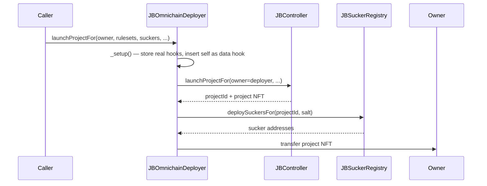
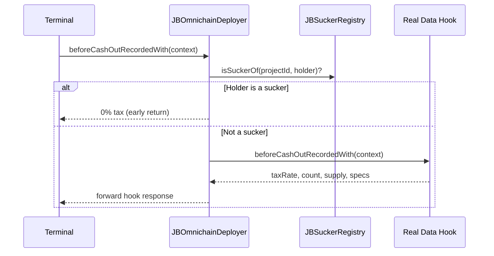

# Juicebox Omnichain Deployers

Deploy Juicebox projects with cross-chain suckers and optional 721 tiers hooks in a single transaction. Acts as a transparent data hook wrapper that gives suckers tax-free cash outs and on-demand mint permission -- without interfering with any custom data hook the project uses.

[Docs](https://docs.juicebox.money) | [Discord](https://discord.gg/juicebox)

## Conceptual Overview

Launching a cross-chain Juicebox project normally takes several steps: deploy the project, configure rulesets, set up terminals, deploy suckers, and wire up a data hook that exempts suckers from cash out taxes. `JBOmnichainDeployer` collapses all of this into one transaction.

It works by inserting itself as the data hook on every ruleset it touches, storing whatever hook the project actually wants in a mapping keyed by `(projectId, rulesetId)`. When the protocol calls data hook functions during payments and cash outs, the deployer:

- **Checks if the holder is a sucker** -- if so, returns 0% cash out tax and grants mint permission. This early return means suckers can always bridge tokens without interference, even if the project's real data hook would revert.
- **Forwards everything else** to the real data hook, or returns default values if none was set.

This wrapping is invisible to the project and its users. The project's custom hook (buyback hook, 721 hook, etc.) works exactly as configured.

### How It Works



During operation:



### 721 Tiers Hook Integration

The `launch721*` and `queue721*` variants deploy a tiered ERC-721 hook alongside the project. The deployer:

1. Deploys the 721 hook via `HOOK_DEPLOYER`
2. Converts 721-specific ruleset configs (`JBPayDataHookRulesetConfig`) to standard configs, enforcing `useDataHookForPay = true` and `allowSetCustomToken = false`
3. Wraps the 721 hook with itself (as above)
4. Transfers hook ownership to the project via `JBOwnable.transferOwnershipToProject()`

### Deterministic Cross-Chain Addresses

Sucker deployment salts are hashed with `_msgSender()` before use:

```
salt = keccak256(abi.encode(userSalt, _msgSender()))
```

This means:
- **Same sender + same salt on each chain = same sucker addresses** (deterministic via CREATE2)
- Different senders can't collide, even with the same salt
- `salt = bytes32(0)` skips sucker deployment entirely

### Ruleset ID Prediction

The deployer stores hook configs keyed by predicted ruleset IDs (`block.timestamp + i`). This works because `JBRulesets` assigns IDs as `latestId >= block.timestamp ? latestId + 1 : block.timestamp`. For new projects, `latestId` starts at 0, so the first ID is always `block.timestamp`.

The `queueRulesetsOf` and `queue721RulesetsOf` functions guard against prediction failures by reverting if `latestRulesetIdOf(projectId) >= block.timestamp` (i.e., rulesets were already queued in the same block).

## Architecture

| Contract | Description |
|----------|-------------|
| `JBOmnichainDeployer` | Deploys projects, rulesets, and suckers. Wraps the project's real data hook to intercept cash outs from suckers (tax-free) and grant suckers mint permission. Implements `IJBRulesetDataHook`, `IERC721Receiver`, `ERC2771Context`, `JBPermissioned`. |

### Supporting Types

| Type | Description |
|------|-------------|
| `JBDeployerHookConfig` | Per-ruleset config storing the real data hook address and its `useDataHookForPay`/`useDataHookForCashOut` flags. |
| `JBSuckerDeploymentConfig` | Wraps an array of `JBSuckerDeployerConfig` with a `bytes32` salt for deterministic cross-chain addresses. |
| `IJBOmnichainDeployer` | Interface for all deployer entry points and the `dataHookOf` view. |

## Install

```bash
npm install @bananapus/omnichain-deployers-v6
```

If using Forge directly:

```bash
forge install Bananapus/nana-omnichain-deployers-v6
```

Add to `remappings.txt`:
```
@bananapus/omnichain-deployers-v6/=lib/nana-omnichain-deployers-v6/
```

## Develop

| Command | Description |
|---------|-------------|
| `forge build` | Compile contracts |
| `forge test` | Run unit, integration, and attack tests |
| `forge test -vvv` | Run tests with full stack traces |
| `npm run deploy:mainnets` | Propose mainnet deployment via Sphinx |
| `npm run deploy:testnets` | Propose testnet deployment via Sphinx |

### Settings

```toml
# foundry.toml
[profile.default]
solc = '0.8.26'
evm_version = 'cancun'
optimizer_runs = 100000

[fuzz]
runs = 4096
```

## Repository Layout

```
src/
  JBOmnichainDeployer.sol               # Main contract (719 lines)
  interfaces/
    IJBOmnichainDeployer.sol            # Public interface
  structs/
    JBDeployerHookConfig.sol            # Stored data hook config
    JBSuckerDeploymentConfig.sol        # Sucker deployment params
test/
  JBOmnichainDeployer.t.sol             # Unit tests
  JBOmnichainDeployerGuard.t.sol        # Ruleset ID prediction tests
  OmnichainDeployerAttacks.t.sol        # Adversarial security tests
script/
  Deploy.s.sol                          # Sphinx deployment script
  helpers/
    DeployersDeploymentLib.sol          # Deployment address helper
```

## Permissions

| Permission | ID | Required For |
|------------|-----|-------------|
| `DEPLOY_SUCKERS` | `JBPermissionIds.DEPLOY_SUCKERS` | `deploySuckersFor` |
| `QUEUE_RULESETS` | `JBPermissionIds.QUEUE_RULESETS` | `launchRulesetsFor`, `launch721RulesetsFor`, `queueRulesetsOf`, `queue721RulesetsOf` |
| `SET_TERMINALS` | `JBPermissionIds.SET_TERMINALS` | `launchRulesetsFor`, `launch721RulesetsFor` |
| `MAP_SUCKER_TOKEN` | `JBPermissionIds.MAP_SUCKER_TOKEN` | Granted to `SUCKER_REGISTRY` globally (projectId=0) at construction |

Note: `launchProjectFor` and `launch721ProjectFor` require no permissions -- anyone can launch a project to any owner.

## Risks

- **Ruleset ID mismatch**: If `_setup()` predictions are wrong (e.g., due to same-block queuing from another source), the stored hook configs will be keyed to the wrong rulesets. The `queueRulesetsOf` guard prevents this, but `launchProjectFor` relies on `PROJECTS.count()` being accurate at call time.
- **Reverting real hook**: If the project's real data hook reverts on `beforePayRecordedWith`, payments are blocked. Suckers are immune to this for cash outs (early return), but not for payments.
- **Hook forwarding is view-only**: The deployer's data hook functions are `view`, so any real hook that requires state changes in `beforePayRecordedWith` or `beforeCashOutRecordedWith` will fail.
- **Meta-transaction trust**: ERC2771 `_msgSender()` is used for salt hashing. A compromised trusted forwarder could impersonate senders and create suckers at unexpected addresses.
