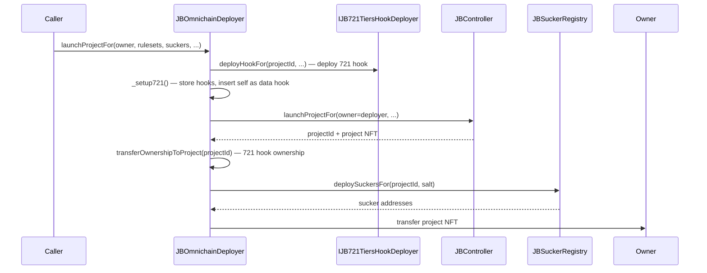
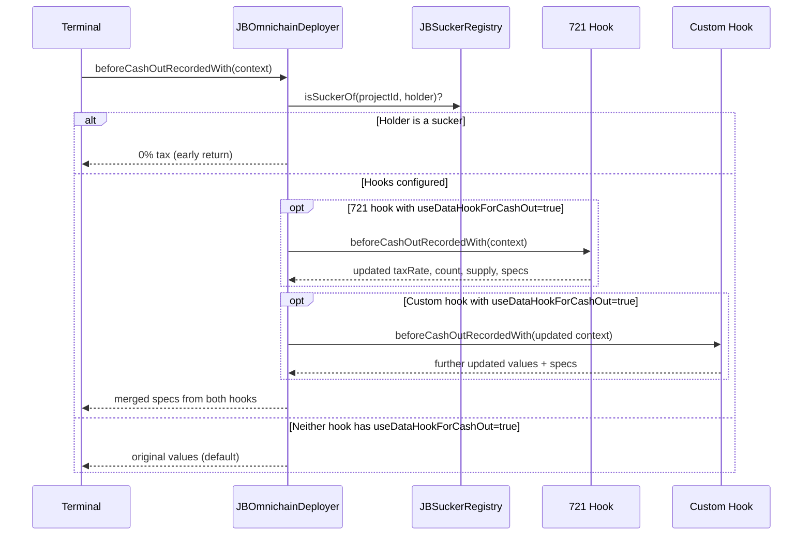

# Juicebox Omnichain Deployers

Deploy Juicebox projects with cross-chain suckers and 721 tiers hooks in a single transaction. Every project gets a 721 hook (even with 0 initial tiers), so projects can add NFT tiers later without reconfiguring. Acts as a transparent data hook wrapper that gives suckers tax-free cash outs and on-demand mint permission -- without interfering with any custom data hook the project uses. Supports composing a 721 tiers hook alongside a custom data hook (e.g., a buyback hook) so both run on every payment.

[Docs](https://docs.juicebox.money) | [Discord](https://discord.gg/juicebox)

## Conceptual Overview

Launching a cross-chain Juicebox project normally takes several steps: deploy the project, configure rulesets, set up terminals, deploy suckers, and wire up a data hook that exempts suckers from cash out taxes. `JBOmnichainDeployer` collapses all of this into one transaction.

It works by inserting itself as the data hook on every ruleset it touches, storing hooks in two separate mappings: the 721 tiers hook is stored per-ruleset in `_tiered721HookOf[projectId][rulesetId]` with its own `useDataHookForCashOut` flag, and an optional custom data hook (e.g., buyback hook) is stored per-ruleset in `_extraDataHookOf[projectId][rulesetId]` with `useDataHookForPay` and `useDataHookForCashOut` flags. When the protocol calls data hook functions during payments and cash outs, the deployer:

- **Checks if the holder is a sucker** -- if so, returns 0% cash out tax and grants mint permission. This early return means suckers can always bridge tokens without interference, even if the project's hooks would revert.
- **Composes the 721 hook and custom data hook** for payments -- the 721 hook is called first (via `tiered721HookOf`) to get its specs (including split fund amounts), then the custom hook from `_extraDataHookOf` (if `useDataHookForPay: true`) is called with a reduced amount context (payment minus split amount) so it only considers the available funds. The 721 hook's weight (already split-adjusted by `JB721TiersHookLib.calculateWeight`) is used directly, ensuring the terminal only mints tokens for the amount that actually enters the project treasury. If the 721 hook returns no specs (0 tiers), it is skipped in the merged output.
- **Composes hooks for cash outs** -- the 721 hook is called first (if `useDataHookForCashOut: true`), updating the cash out parameters (tax rate, count, supply). Then the custom hook is called (if `useDataHookForCashOut: true`) with the already-updated values from the 721 hook. Both hooks' specifications are merged into a single array (721 specs first, then custom hook specs). If the 721 hook has `useDataHookForCashOut: true` and reverts (e.g., for fungible-only cashouts), that revert propagates. Set `useDataHookForCashOut: false` on the 721 config to skip it.
- **Returns default values** if neither hook has the relevant flag set.

This wrapping is invisible to the project and its users. The project's hooks (buyback hook, 721 hook, etc.) work exactly as configured, and can be composed together.

### How It Works



During operation:



### 721 Tiers Hook Integration

Every project deployed through `JBOmnichainDeployer` gets a 721 tiers hook, even with 0 initial tiers. This lets projects add NFT tiers later without needing to reconfigure the data hook. The deployer:

1. Deploys the 721 hook via `HOOK_DEPLOYER`
2. Transfers hook ownership to the project via `JBOwnable.transferOwnershipToProject(projectId)` (after the project NFT exists)
3. Stores the 721 hook per-ruleset in `_tiered721HookOf[projectId][rulesetId]` with its `useDataHookForCashOut` flag
4. Sets itself as the data hook on each ruleset, enforcing `useDataHookForPay = true` and `useDataHookForCashOut = true`
5. Stores the optional custom hook (e.g., buyback hook) separately in `_extraDataHookOf[projectId][rulesetId]` with its own per-hook flags

For `queueRulesetsOf`, if no new tiers are provided, the 721 hook from the latest ruleset is carried forward instead of deploying a new one.

This means a project can have both a 721 hook (for NFT minting on payments) and a custom data hook (for buyback, custom weight logic, etc.) running simultaneously. During both payments and cash outs, the hooks are called sequentially (721 hook first, then custom hook) and their specifications are merged.

### Simplified Overloads

Each of `launchProjectFor`, `launchRulesetsFor`, and `queueRulesetsOf` has a simplified overload that omits the `deploy721Config` parameter. These use `_default721Config(rulesetConfigurations)`, which creates an empty-tier 721 config with `currency` from the first ruleset's `baseCurrency`, `decimals = 18`, `useDataHookForCashOut = false`, and no salt. At least one ruleset configuration is required. For `queueRulesetsOf`, since the default config has 0 tiers, the existing 721 hook is always carried forward.

### Deterministic Cross-Chain Addresses

Sucker deployment salts are hashed with `_msgSender()` before use:

```
salt = keccak256(abi.encode(userSalt, _msgSender()))
```

This means:
- **Same sender + same salt on each chain = same sucker addresses** (deterministic via CREATE2)
- Different senders can't collide, even with the same salt
- `salt = bytes32(0)` skips sucker deployment entirely

### Supported Chains

`JBOmnichainDeployer` supports the same chains as the sucker deployers it wraps. Currently supported:

- **Mainnets**: Ethereum, Optimism, Base, Arbitrum
- **Testnets**: Ethereum Sepolia, Optimism Sepolia, Base Sepolia, Arbitrum Sepolia

To deploy a cross-chain project, call `launchProjectFor` on each chain with the same salt. The sucker deployers use CREATE2 so that matching salts from the same sender produce deterministic addresses across chains.

### Ruleset ID Prediction

The deployer stores hook configs keyed by predicted ruleset IDs (`block.timestamp + i`). This works because `JBRulesets` assigns IDs as `latestId >= block.timestamp ? latestId + 1 : block.timestamp`. For new projects, `latestId` starts at 0, so the first ID is always `block.timestamp`.

The `queueRulesetsOf` function guards against prediction failures by reverting if `latestRulesetIdOf(projectId) >= block.timestamp` (i.e., rulesets were already queued in the same block).

## Architecture

| Contract | Description |
|----------|-------------|
| `JBOmnichainDeployer` | Deploys projects, rulesets, and suckers. Wraps the project's real data hook to intercept cash outs from suckers (tax-free) and grant suckers mint permission. Implements `IJBRulesetDataHook`, `IERC721Receiver`, `ERC2771Context`, `JBPermissioned`. |

### Supporting Types

| Type | Description |
|------|-------------|
| `JBOmnichain721Config` | 721 hook deployment config: `deployTiersHookConfig` (tier configuration), `useDataHookForCashOut` flag, and `salt` for deterministic deployment. Passed to all deploy/launch/queue functions. |
| `JBDeployerHookConfig` | Per-hook config with `dataHook`, `useDataHookForPay`, and `useDataHookForCashOut` flags. Stored as a single value per `(projectId, rulesetId)` in `_extraDataHookOf` for the custom data hook. |
| `JBTiered721HookConfig` | Per-ruleset 721 hook config with `hook` (the `IJB721TiersHook`) and `useDataHookForCashOut` flag. Stored per `(projectId, rulesetId)` in `_tiered721HookOf`. |
| `JBSuckerDeploymentConfig` | Wraps an array of `JBSuckerDeployerConfig` with a `bytes32` salt for deterministic cross-chain addresses. |
| `IJBOmnichainDeployer` | Interface for all deployer entry points and the `extraDataHookOf` view. |

## Install

```bash
npm install @bananapus/omnichain-deployers-v6
```

If using Forge directly:

```bash
forge install Bananapus/nana-omnichain-deployers-v6
```

Add to `remappings.txt`:
```
@bananapus/omnichain-deployers-v6/=lib/nana-omnichain-deployers-v6/
```

## Develop

| Command | Description |
|---------|-------------|
| `forge build` | Compile contracts |
| `forge test` | Run unit, integration, and attack tests |
| `forge test -vvv` | Run tests with full stack traces |
| `npm run deploy:mainnets` | Propose mainnet deployment via Sphinx |
| `npm run deploy:testnets` | Propose testnet deployment via Sphinx |

### Settings

```toml
# foundry.toml
[profile.default]
solc = '0.8.26'
evm_version = 'cancun'
via_ir = true
optimizer_runs = 200

[fuzz]
runs = 4096
```

## Repository Layout

```
src/
  JBOmnichainDeployer.sol                       # Main contract (~817 lines)
  interfaces/
    IJBOmnichainDeployer.sol                    # Public interface
  structs/
    JBDeployerHookConfig.sol                    # Custom hook config (dataHook + flags)
    JBOmnichain721Config.sol                    # 721 hook deployment config
    JBSuckerDeploymentConfig.sol                # Sucker deployment params
    JBTiered721HookConfig.sol                   # Per-ruleset 721 hook config
test/
  JBOmnichainDeployer.t.sol                     # Unit tests
  JBOmnichainDeployerGuard.t.sol                # Ruleset ID prediction tests
  OmnichainDeployerAttacks.t.sol                # Adversarial security tests
  OmnichainDeployerEdgeCases.t.sol              # Edge case tests (weight, cashout, mint)
  OmnichainDeployerReentrancy.t.sol             # Reentrancy tests
  TestAuditGaps.sol                             # Audit gap coverage tests
  Tiered721HookComposition.t.sol                # 721 hook + custom hook composition tests
  fork/
    OmnichainForkTestBase.sol                   # Shared fork test base
    TestOmnichain721QueueAndAdjust.t.sol        # Fork: queue and adjust 721 tiers
    TestOmnichainCashOutFork.t.sol              # Fork: cash out flows
    TestOmnichainStressFork.t.sol               # Fork: stress / load tests
    TestOmnichainWeightFork.t.sol               # Fork: weight decay tests
    TestSuckerDeploymentFork.t.sol              # Fork: sucker deployment
  invariants/
    OmnichainDeployerInvariant.t.sol            # Invariant tests
    handlers/
      OmnichainDeployerHandler.sol              # Invariant handler
  regression/
    HookOwnershipTransfer.t.sol                 # Hook ownership transfer regression
    ValidateController.t.sol                    # Controller validation regression
script/
  Deploy.s.sol                                  # Sphinx deployment script
  helpers/
    DeployersDeploymentLib.sol                  # Deployment address helper
```

## Permissions

| Permission | ID | Required For |
|------------|-----|-------------|
| `DEPLOY_SUCKERS` | `JBPermissionIds.DEPLOY_SUCKERS` | `deploySuckersFor` |
| `QUEUE_RULESETS` | `JBPermissionIds.QUEUE_RULESETS` | `launchRulesetsFor`, `queueRulesetsOf` |
| `SET_TERMINALS` | `JBPermissionIds.SET_TERMINALS` | `launchRulesetsFor` |
| `MAP_SUCKER_TOKEN` | `JBPermissionIds.MAP_SUCKER_TOKEN` | Granted to `SUCKER_REGISTRY` globally (projectId=0) at construction |

Note: `launchProjectFor` requires no permissions -- anyone can launch a project to any owner.

## Risks

- **Ruleset ID mismatch**: If `_setup721()` predictions are wrong (e.g., due to same-block queuing from another source), the stored hook configs will be keyed to the wrong rulesets. The `queueRulesetsOf` guard prevents this, but `launchProjectFor` relies on `PROJECTS.count()` being accurate at call time.
- **Reverting real hook**: If any stored hook reverts on `beforePayRecordedWith`, payments are blocked. If the 721 hook has `useDataHookForCashOut: true`, its revert for fungible cashouts propagates. Suckers are immune to this for cash outs (early return), but not for payments.
- **Hook forwarding is view-only**: The deployer's data hook functions are `view`, so any real hook that requires state changes in `beforePayRecordedWith` or `beforeCashOutRecordedWith` will fail.
- **Meta-transaction trust**: ERC2771 `_msgSender()` is used for salt hashing. A compromised trusted forwarder could impersonate senders and create suckers at unexpected addresses.
- **Ownership transfer timing**: The 721 hook's ownership is transferred to the project after the project NFT is minted. In `launchProjectFor`, the hook is deployed before the project exists, and ownership is transferred after `controller.launchProjectFor` returns. If the controller call reverts, the hook exists but is owned by the deployer (the whole transaction reverts, so this is safe).
